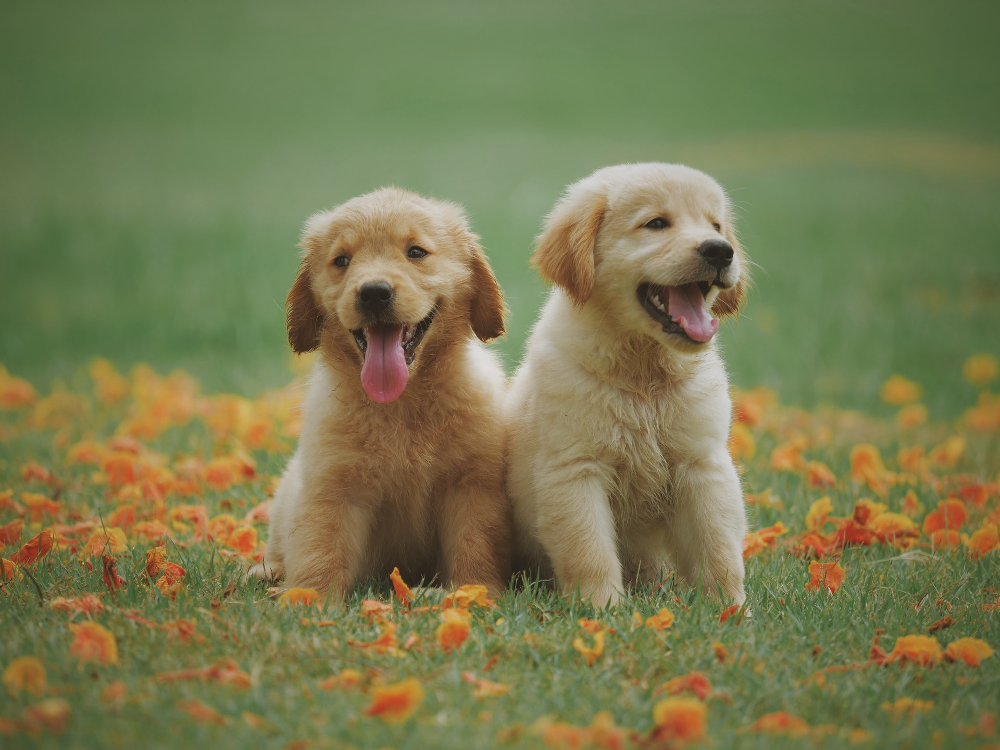

---
---

<link rel="stylesheet" href="styles.css" type="text/css">

I am a systems neuroscientist investigating how the brain controls the movements of our hands. I work as a post-doctoral researcher in the [Department of Neurobiology](https://www.dpz.eu/en/unit/neurobiology.html) (Abteilung Neurobiologie) at the [German Primate Center](https://www.dpz.eu/en/home.html) (Deutsches Primatenzentrum) in the lab of Hans Scherberger. I am currently researching the topic of "Mirror neurons" and their contribution, at the single-neuronal and population levels, to the neural processing underlying grasping movements.

I received my Ph.D. in Computational Neuroscience in December 2018 from the University of Chicago, where I worked in the laboratory of [Sliman Bensmaia](http://bensmaialab.org/) on the postural nature of the representation of hand in the proprioceptive somatosensory and primary motor cortices. 

I graduated from Drexel University in 2013 with a BS and MS in Biomedical Engineering.

My full CV is available [here](files/JMG_CV_2020_04_15.pdf).

The image of dogs is a placeholder. Credit where it's due, though: [Photo by Chevanon Photography from Pexels](https://www.pexels.com/photo/two-yellow-labrador-retriever-puppies-1108099/)

This site is also built by using the site of [Emily Zabor](http://www.emilyzabor.com/) as a template and simply changing the data to reflect my own identity. So if the site looks similar or you see remnants of elements that are related to her, that's why.